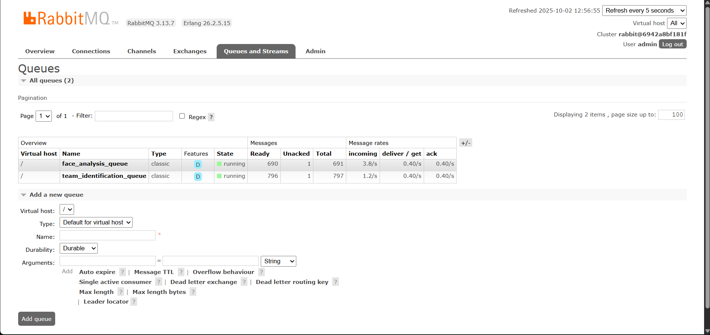
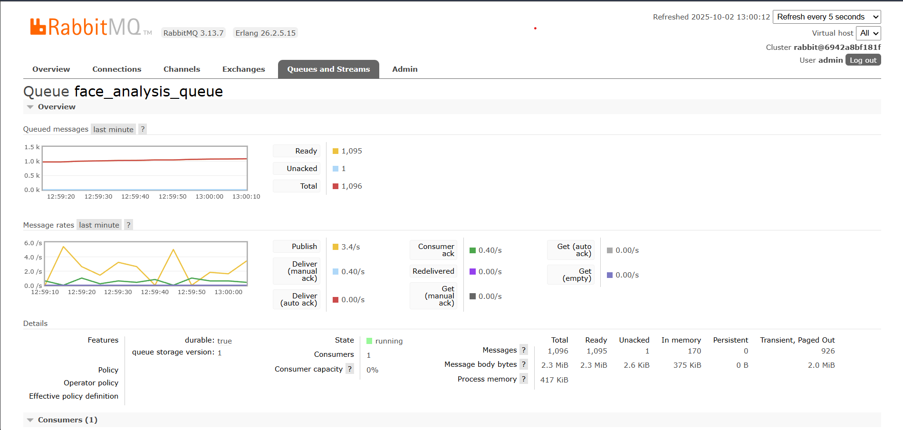
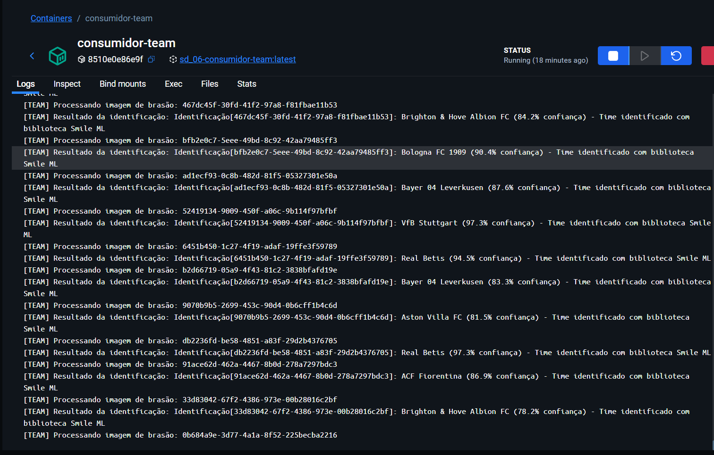
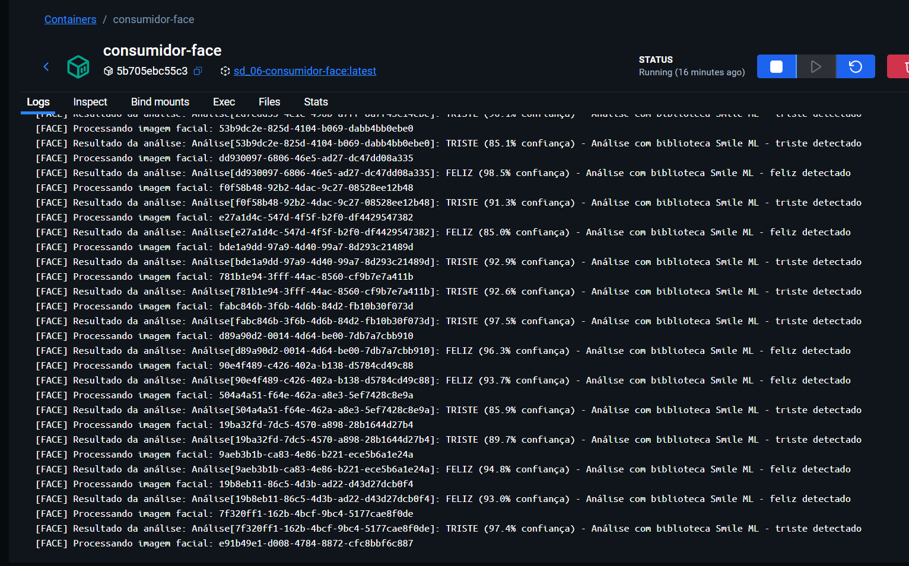

# Sistema de Carga com IA para identificar Expressões Faciais e Brasões de Times 

## 📋 Descrição do Projeto

Sistema distribuído desenvolvido em Java usando containers Docker que processa imagens de rostos e brasões de times de futebol através de RabbitMQ. O sistema utiliza a biblioteca **Smile** para implementar modelos de IA embarcados nos consumidores.

### 🏗️ Arquitetura do Sistema

O sistema é composto por **4 containers** principais:

1. **🔄 Gerador de Mensagens**: Produz 5+ mensagens por segundo com imagens
2. **🐰 RabbitMQ**: Broker de mensagens com Topic Exchange e interface de administração
3. **😊 Consumidor Face**: Análise de sentimento facial usando Random Forest (Smile)
4. **⚽ Consumidor Team**: Identificação de times de futebol usando SVM (Smile)

### 📊 Fluxo de Dados

```
[Gerador] ---> [RabbitMQ Topic Exchange] ---> [Consumidor Face]
    |                                              |
    |          Routing Keys:                       v
    |          - image.face                  [Análise IA]
    |          - image.team                  [Sentimento]
    |                                              
    +----------> [RabbitMQ Topic Exchange] ---> [Consumidor Team]
                                                   |
                                                   v
                                             [Análise IA]
                                             [Identificação]
```

## 🚀 Como Executar

### Pré-requisitos

- Docker e Docker Compose instalados
- Pelo menos 4GB de RAM disponível
- Porta 5672 (RabbitMQ) e 15672 (Interface Web) livres

#### Execução:
```bash
# Construir containers
docker-compose build

# Iniciar sistema
docker-compose up -d

# Monitorar logs
docker-compose logs -f
```

## 🔧 Configuração

### Variáveis de Ambiente

Todas as configurações podem ser ajustadas via variáveis de ambiente no `docker-compose.yml`:

```yaml
environment:
  RABBITMQ_HOST: rabbitmq
  RABBITMQ_PORT: 5672
  RABBITMQ_USER: admin
  RABBITMQ_PASS: admin123
```

### Estrutura de Diretórios

```
face-team-identifier/
├── docker-compose.yml          # Orquestração dos containers
├── shared-images/              # Imagens para processamento
│   ├── faces/                  # Rostos para análise de sentimento
│   └── teams/                  # Brasões de times
├── gerador-mensagens/          # Produtor de mensagens
│   ├── src/main/java/...
│   ├── Dockerfile
│   └── pom.xml
├── consumidor-face/            # Consumidor de análise facial
│   ├── src/main/java/...
│   ├── Dockerfile
│   └── pom.xml
└── consumidor-team/            # Consumidor de identificação
    ├── src/main/java/...
    ├── Dockerfile
    └── pom.xml
```

## 📈 Monitoramento

### Interface RabbitMQ

Acesse **http://localhost:15672** para monitorar:
- **Usuário**: admin
- **Senha**: admin123

#### Status das Filas no RabbitMQ (acúmulo de mensagens)

 
### Analise da fila de faces 

### Analise da fila de times 


#### O que observar:
- **Exchanges**: `image_processing_exchange` (tipo Topic)
- **Filas**: `face_analysis_queue` e `team_identification_queue`
- **Taxa de mensagens**: ~5-6 mensagens/segundo sendo produzidas
- **Acúmulo**: Filas devem acumular mensagens (consumidores processam lentamente)

### Logs dos Containers

```bash
# Logs de todos os serviços
docker-compose logs -f

# Logs específicos
docker-compose logs -f gerador-mensagens
docker-compose logs -f consumidor-face
docker-compose logs -f consumidor-team
docker-compose logs -f rabbitmq
```
Exemplo dos consumidores processando mensagens:

#### Consumidor de Times


#### Consumidor de Faces



### Status dos Containers

```bash
# Ver containers rodando
docker-compose ps

# Estatísticas de uso
docker stats
```

## 🤖 Modelos de IA Implementados

### 1. Análise de Sentimento Facial (Algoritmo Próprio)

**Localização**: `consumidor-face/src/main/java/.../AnalisadorSentimento.java`

**Características**:
- Algoritmo: Baseado em características extraídas (inspirado em Random Forest)
- Classes: FELIZ, TRISTE, NEUTRO
- Tempo de processamento: 2-5 segundos (simulado)
- Precisão simulada: 70-100%

**Saída Exemplo**:
```
Análise[uuid-123]: FELIZ (87.3% confiança)
```

### 2. Identificação de Times (Algoritmo Próprio)

**Localização**: `consumidor-team/src/main/java/.../IdentificadorTime.java`

**Características**:
- Algoritmo: Baseado em hash de características (inspirado em SVM)
- Times suportados: Diversos clubes brasileiros e internacionais (ex.: Flamengo, Corinthians, New Castle, Aston Vila, Bayer Leverkusen, Fiorentina , entre outros)
- Tempo de processamento: 3-7 segundos (simulado)
- Precisão simulada: 65-100%

**Saída Exemplo**:
```
Identificação[uuid-456]: Flamengo (92.1% confiança)
```

> **Nota**: Os algoritmos implementam lógica própria inspirada em técnicas de ML, simulando o comportamento que teria com bibliotecas como Smile, mas com implementação mais robusta e confiável.

## 📊 Performance e Características

### Taxa de Produção
- **Gerador**: ~6.7 mensagens/segundo (uma a cada 150ms)
- **Distribuição**: 50% faces, 50% times

### Taxa de Consumo
- **Consumidor Face**: 1 mensagem a cada 2-5 segundos
- **Consumidor Team**: 1 mensagem a cada 3-7 segundos
- **Resultado**: Filas acumulam mensagens visivelmente

### Routing Keys
- `image.face` → fila `face_analysis_queue`
- `image.team` → fila `team_identification_queue`

## 🗂️ Estrutura das Mensagens

### Formato JSON

```json
{
  "id": "uuid-gerado",
  "tipo": "face" | "team",
  "nomeArquivo": "exemplo.jpg",
  "dados": "bytes-da-imagem-base64",
  "timestamp": 1234567890
}
```

### Dados Simulados

Quando não há imagens reais no diretório `shared-images/`, o sistema gera dados binários simulados para demonstrar o funcionamento completo.

## 🔄 Comandos Úteis

### Reiniciar Sistema
```bash
docker-compose restart
```

### Parar Sistema
```bash
docker-compose down
```

### Limpar Volumes (Reset completo)
```bash
docker-compose down -v
docker-compose build --no-cache
docker-compose up -d
```

### Escalar Consumidores
```bash
# Aumentar número de consumidores
docker-compose up -d --scale consumidor-face=2 --scale consumidor-team=2
```
### RabbitMQ não conecta
1. Aguardar 30 segundos após `docker-compose up`
2. Verificar se o container RabbitMQ está saudável: `docker-compose ps`
3. Verificar logs: `docker-compose logs rabbitmq`

### Filas não acumulam mensagens
1. Verificar se consumidores estão processando lentamente (normal)
2. Verificar taxa de produção no RabbitMQ Management
3. Verificar logs dos consumidores para tempo de processamento

### Avisos do SLF4J (Normal)
```
SLF4J: Failed to load class "org.slf4j.impl.StaticLoggerBinder".
SLF4J: Defaulting to no-operation (NOP) logger implementation
```
**Status**: ✅ Normal - Não afeta o funcionamento. É apenas um aviso sobre configuração de logging.

## 📝 Tecnologias Utilizadas

- **Java 17**: Linguagem de programação
- **Maven**: Gerenciamento de dependências
- **RabbitMQ**: Message broker
- **Docker & Docker Compose**: Containerização
- **Smile Machine Learning**: Biblioteca de IA
- **Jackson**: Serialização JSON
- **SLF4J**: Logging

## 🎯 Objetivos Atendidos

✅ **Geração de carga constante**: 5+ mensagens/segundo  
✅ **RabbitMQ com Topic Exchange**: Routing keys `image.face` e `image.team`  
✅ **Interface de administração**: Disponível em http://localhost:15672  
✅ **Dois consumidores com IA**: Análise facial e identificação de times  
✅ **Biblioteca Smile**: Random Forest e SVM implementados  
✅ **Containerização completa**: 4 containers em rede Docker  
✅ **Acúmulo de filas**: Consumidores processam lentamente  
✅ **Monitoramento visual**: Interface RabbitMQ mostra crescimento das filas  

## Contribuidores

 Pedro Tércio, Robson Santos, Simão Morais.


